# 新武將介紹 - 命的語劑 (2025 06 Warrior Class Rework)

**Folder:** `2025-06-warrior-class-rework`  
**Generated:** 2025-12-23 21:56:11

---

## 📷 Announcement Images

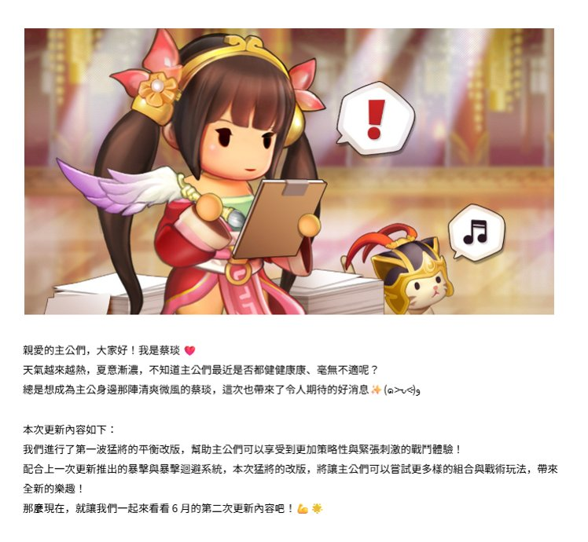

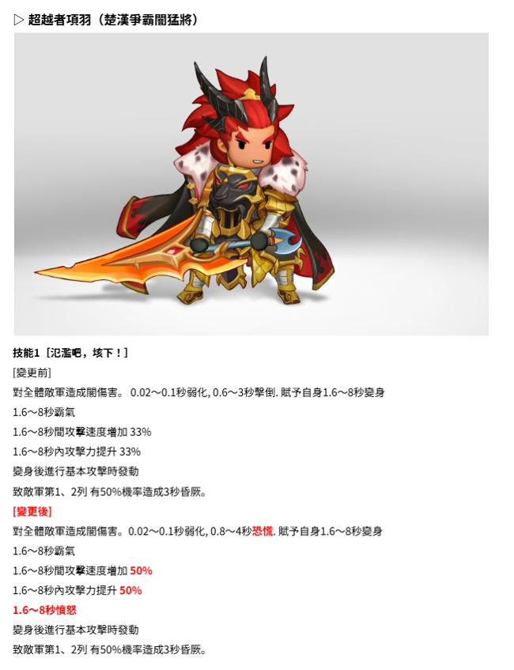

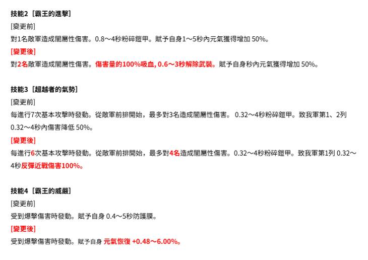

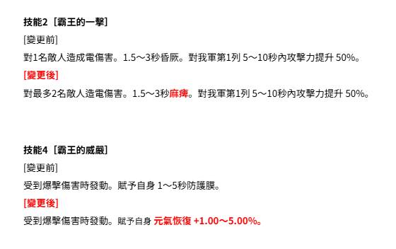

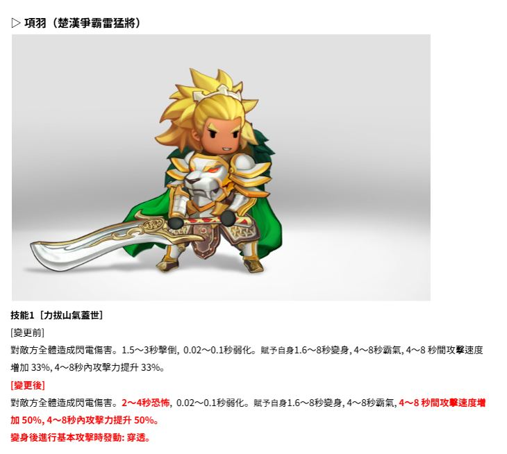

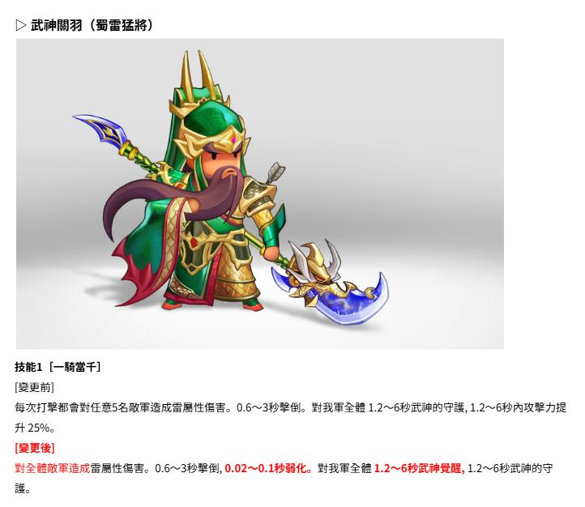

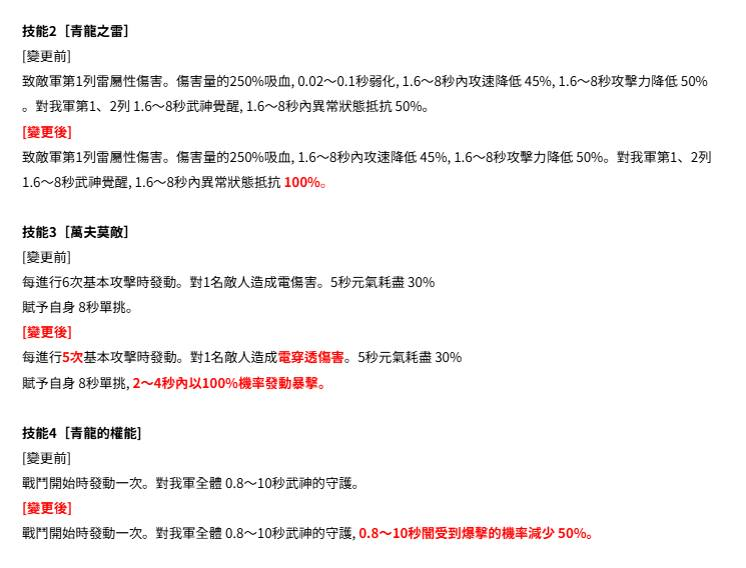

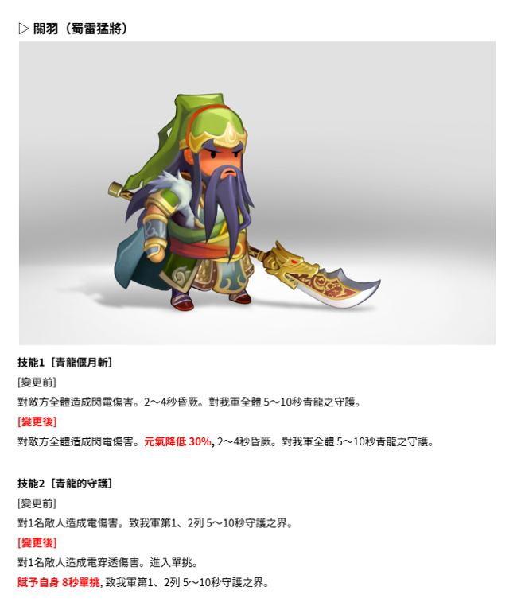

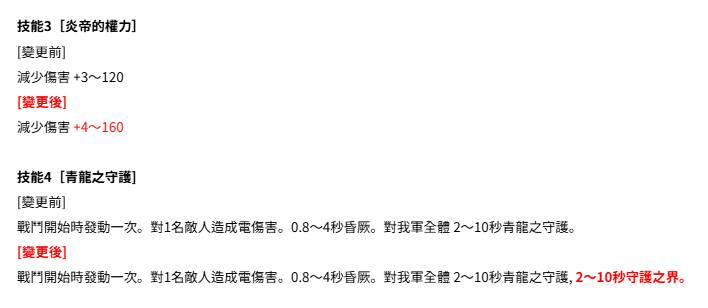

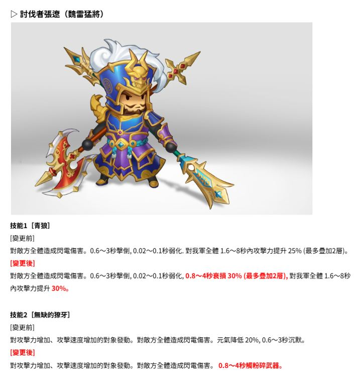

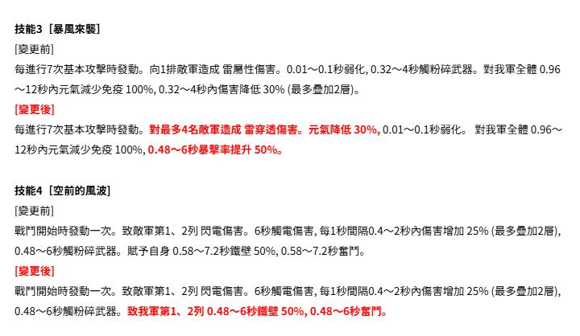

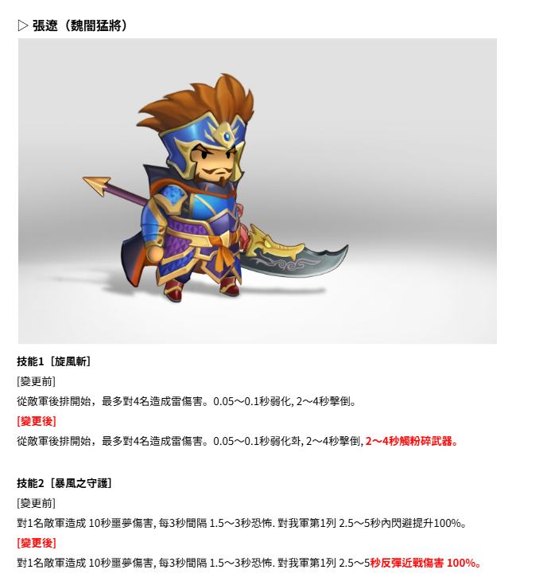

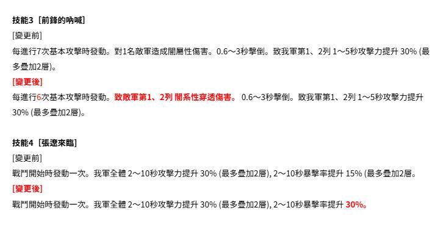

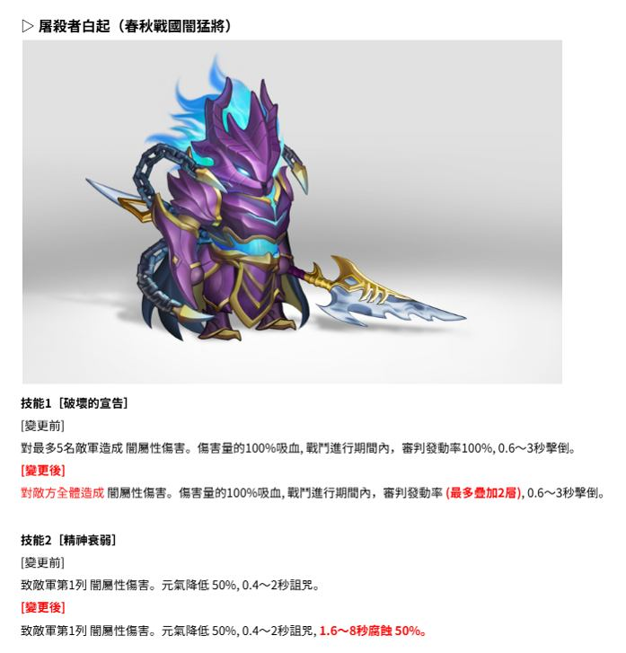

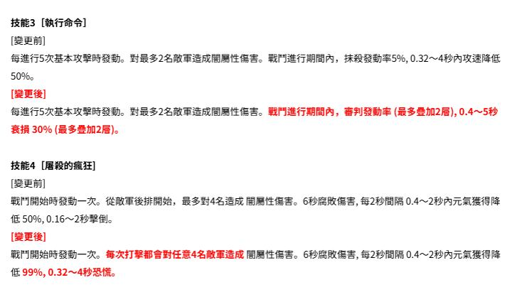


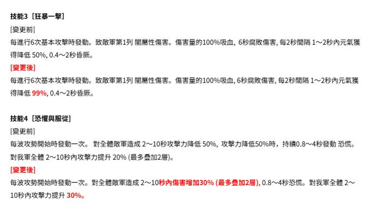

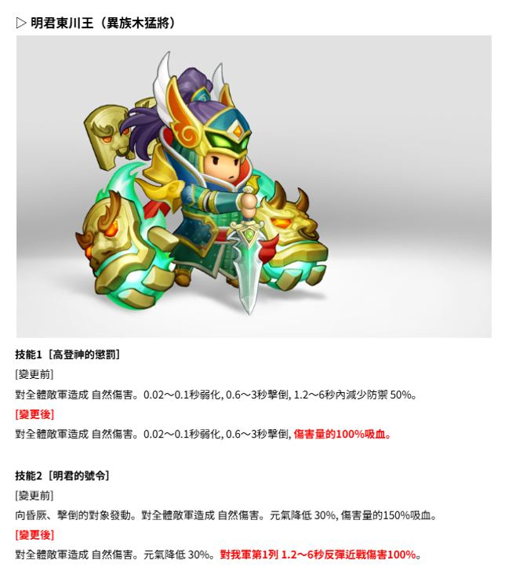

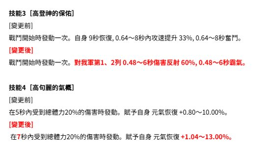

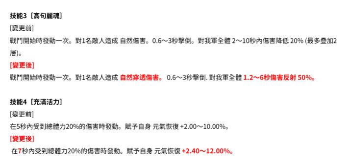

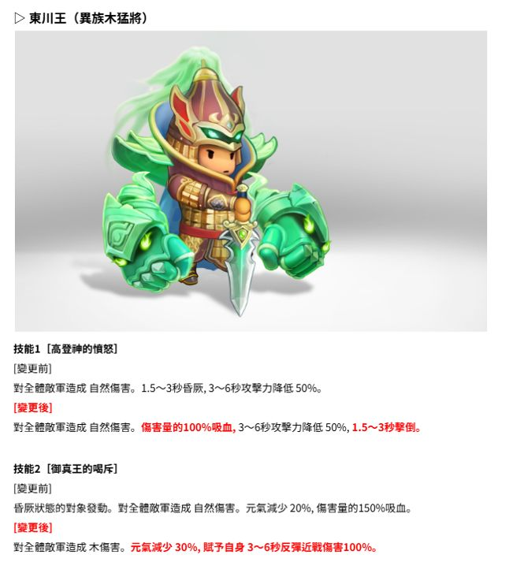


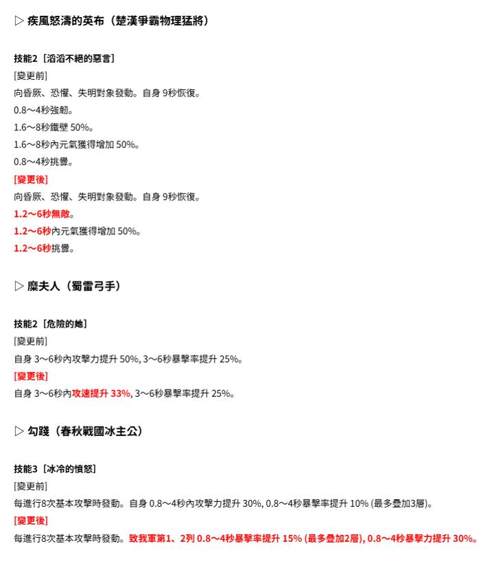

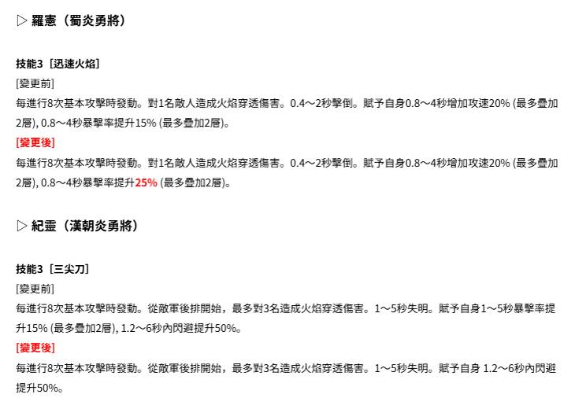

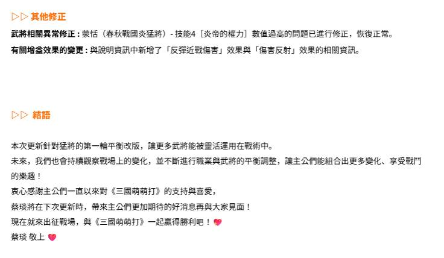

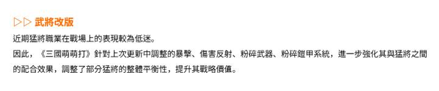

---

## 🔶 Character Name & Headers (Orange Text Detection)

```
(人 1人 . , 人 計 !,,,苹 x嗆 ,。 加 學 0 三 命 的 語劑

國旺旦 2自 人弘宮生 Mi如 9和 時生并難 【  二入 開還玉點六歷0 ag 全了全點 噴3E 和
```

## 💡 Highlighted Text (Brightness Detection)

```
和 蝦 意合 9對 z 信 】 “和 了脫 也  昌噴u Vs 全 和 玻葬的主公們, 大昧好! 我量耕寺 咐 天氫交來赴熟, 軸瑟喜主, 不知道主公們午近電至歷健伍康呆、音氰不適呈7了 暗曄杞或為主公奧洪宛陳看負黴風的緊焉, 中次也得來了令人和人選竺的好消息 、(oyud3 本次時新內歡果下 : 我們進行了第一效環壯的平銜改原, 握助主公們可以轉受列更加節咯性殃靶蛋炒基的同 體驗! 配合上一次天新推出的晶員畢畢恒几系凡, 本次琶將的改版, 醫讓主公們可以舍試更多模的姐合農聯術玩法, 宵說 釦的斷商  醋摩現在, 抵小我們一起來書看 6 月的策二次點新內得吧了

選 址元者項弛 (剷滿爭需圈亞芷) 全4 語 ~上 號ws / 生 ],且 一 和 說 技論1[氾基吧, 凜下!] [綢加前] 全侈體艇吾人造成聘兌宵。 0.02一0.1秒啊化,0.6~3秒國儲. 賦予自興16一8科南身 16~-8秒用氮 16~8和如雪呈正度增加 33W% 1.6~8憩內政莫力提升 33$ 過身後進衝本下還峙枝重 襄凡只氮1、2列 有509tb林各二成3私協床, 1人4 時全主吃量自成妥偽和侍, 0.02一0
... (truncated)
```

## 📝 Skills & Description (Standard OCR)

```
還 2 人 4 上人Ca、 說 一全、 化 一 【 伍 和 4 、放 /念. 9 較 4 A 【 人(一 全和人 ! ee 親愛的主公們, 大家好! 我是蔡玖 人 天氣越來越熱, 夏仿漸濃, 不知道主公們最近是否都健健康康、毫無不適呢 ? 總是想成為主公身邊那陣清學微昌的蔡現, 這次也帶來了令人期待的好消息.、(e>uv99 本次更新內容如下: 我們進行了第一波猛將的平衡改版, 幫助主公們可以享受到更加策略性與緊張刺激的戰鬥體驗 ! 配合上一次望新推出的暴擊與暴敬迴避系統, 本次猛將的改版, 將讓主公們可以窒試更多樣的組合與戰術玩法, 帶來 全新的煌趣 ! 悸麼現在, 就讓我們一起來看看6 月的第二次更新內容螞 !C 立

蕊 超越者項到 (楚漢爭裕痢猛將) 、念, 全人 ( 人 一 Aa 人 二 。 國了 全 MR人和 技能1 [氾濫咽, 坊下!] [獎更前] 對全體敵軍造成閏傷害。 0.02~0.1秒弱化, 0.6~3秒擊倒. 賦予自身1.6~8秒綻身 1.6~8秒遍氣 1.6~~8秒間攻擊速度增加 339% 1.6~8秒內攻擊力提升 33% 學身後進行基本攻擊時發動 致敵才第1、2列 有509e機率造成3秒白朱。 [絃更後] 對全體英軍造成閱倡害。0.02~0.1秒弱化, 0.8~4秒恐慌. 賦予自身1.6~8秒腑身 1.6~8秒兩氣 1.6~8秒章必擊速度增加 509% 1.6~8秒內攻擊力揚升 5066 1.6~8秒憤怒 龜身後進行基本攻擊時發動 致敵軍第1、2列 有5096機率造成3秒告厥。

技能2 [霸王的送擊] [眉更前] 對1名英軍造成閱乙性傷害。0.8~~4秒粉碎銓甲。賦予自身1~5秒內元氣獲得增加 5096。 [變更後] 對2名碳軍造成閃屆性傷害。傷審量的10036吸自, 0.6一3秒解除武裝。色予自身秒內元氣獲得增加 50%6。 技能3 [超越者的氣勢] [變更前] 每進行7次基本攻擊時發動。從敵第前排閥始, 最多對3名造成間蝦性促害。 0.32~4秒粉碎鎧甲。致我當第1、2列 0.32~4秒內傷害降低 509%。 [變更後] 每進行6次基本攻擊時發勁。從敵軍前排開始, 最多對4名造成病恒性傷害。0.32~4秒粉碎鎧甲。致我電第1列 0.32人~ 4秒反彈近戰傷害100%6。 技能4 [霸王的威嚴] [引更前] 受到爆擊傷害時發動。多予自身0.4~~5秒防護膜。 [變更後] 受到爆擊傷害時發動。賦予自身 元氧恢復 +0.48一6.00%6。
```

---

*Generated by Kingdom Story Photo Scanner v2.0 (Enhanced Multi-Strategy OCR)*
