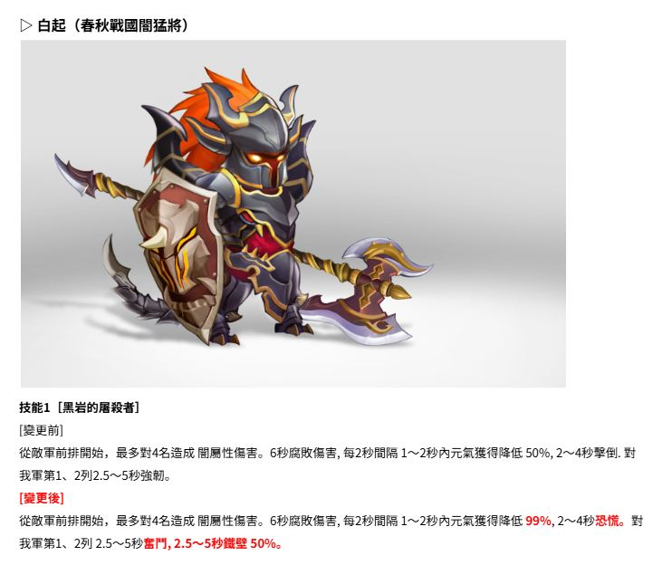

# 新武將介紹 - 越者項瑪 2025 06 Warrior Class Rework

**Folder:** 2025-06-warrior-class-rework

## Announcement Images





## OCR Extracted Text
```
A ae W 議 字 | 說 說 . 全 [ 還 革 人 全 1 人 %弄 上人一、、 命 時 辣 【 還 \ z生人 』 3六 了 攻 + 【】 【、 Ed 4 【 6誤 /念 9 衣 史 add人 |! H (一 同 全 人 一一 二 」 點 (+ 呈 i 點 一 咯 親愛的主公們, 大家好 ! 我是蔡下 俯 天氣越來越熱, 夏瑟漸濃, 不知道主公們最近是否都健健康康、府無不適呢 ? 練是想成為主公身邊那陣清爽微書的蔡焉, 這次也帶來了令人期待的好消息、 (e>ua9 本次更新內容如下 : 我們進行了第一波猛將的平衡改版,軋助主公們可以享受到更加策略性與緊張刺激的戰鬥體驗 ! 配合上一次更新推出的暴學與暴學迴避系統, 本次猛將的改版, 將讓主公們可以答試更多樣的組合與戰術玩法, 帶來 全新的樂趣 ! 那麼現在, 就讓我們一起來看看6 月的第二次更新內容另! 計
2 4 3 人 【 呈和es | ae 誠 點 【 “才 多 表有 條1 國蟬 克 區 2 [語調 玉 [批重後】 叫慌 506G 5096 1.6~8粉居翅 芒 超越者項瑪(想漢爭莽導猛將) 、念, 2 二 圖 Aa 人 二 。 國說 太全 MR人 技能1 [氾濫咽, 坊下!] [獎更前] 對全體敵軍造成閏傷害。 0.02~0.1秒弱化, 0.6~3秒擊倒. 賦予自身1.6~8秒綻身 1.6~8秒敵氣 1.6~~8秒間攻擊速度增加 339% 1.6~8秒內攻擊力提升 33% 學身後進行基本攻擊時發動 致敵才第1、2列 有509e機率造成3秒白朱。 [紀更後] 對全體英軍造成閱倡害。0.02~0.1秒弱化, 0.8~4秒恐慌. 賦予自身1.6~8秒腑身 1.6~~8秒廈氣 1.6~8秒章攻擊速度增加 506% 1.6~8秒內攻擊力揚升 5066 1.6~8秒憤怒 龜身後進行基本攻擊時發動 致敵軍第1、2列 有5096機率造成3秒告厥。
[弦更箇] 2名. 傷雁是的100Ao吧和瞄,0.6~3季解除武裝, [變更後] 人 4急. 所孽近肝侯害10050。 上4:】 元氟焦竹 +0.48一6.005e, 技能2 [霸王的送擊] [眉更前] 對1名英軍造成閱乙性傷害。0.8~~4秒粉碎銓甲。賦予自身1~5秒內元氣獲得增加 5096。 [變更後] 對2名敵軍造成閃屆性傷害。傷害最的100吸自, 0.6一3秒解除武
```
