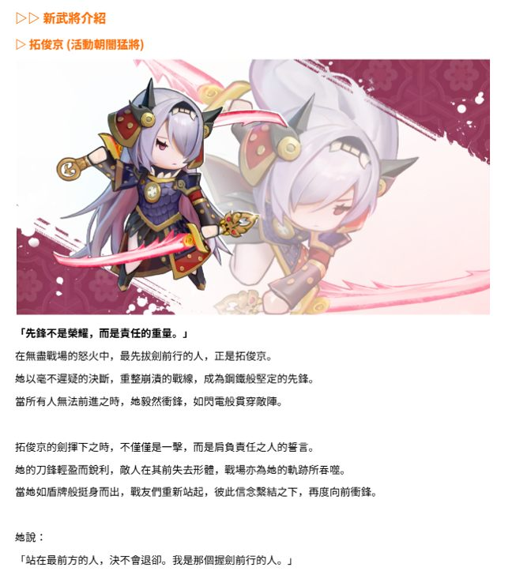
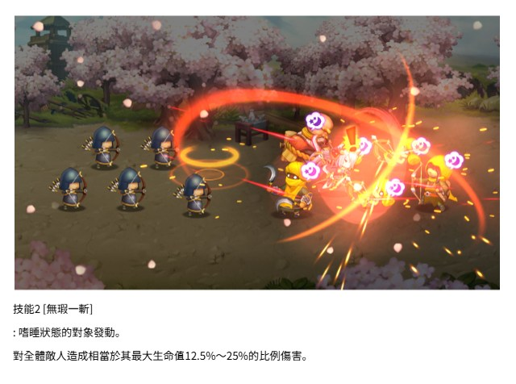
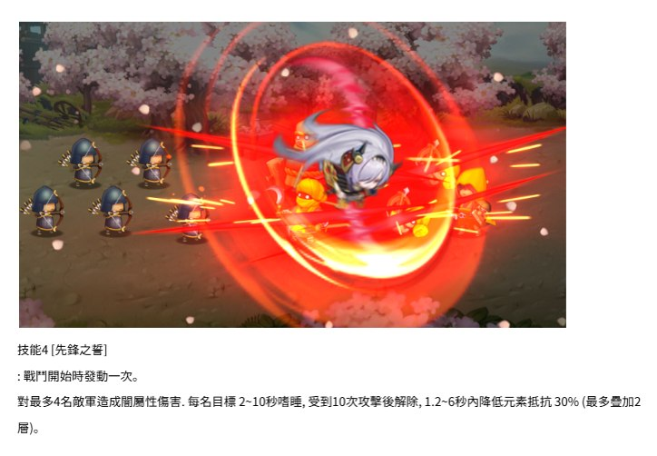
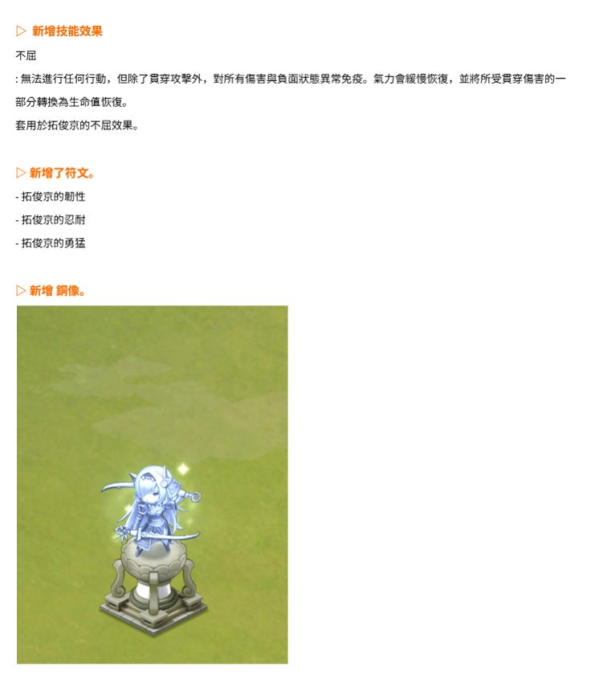
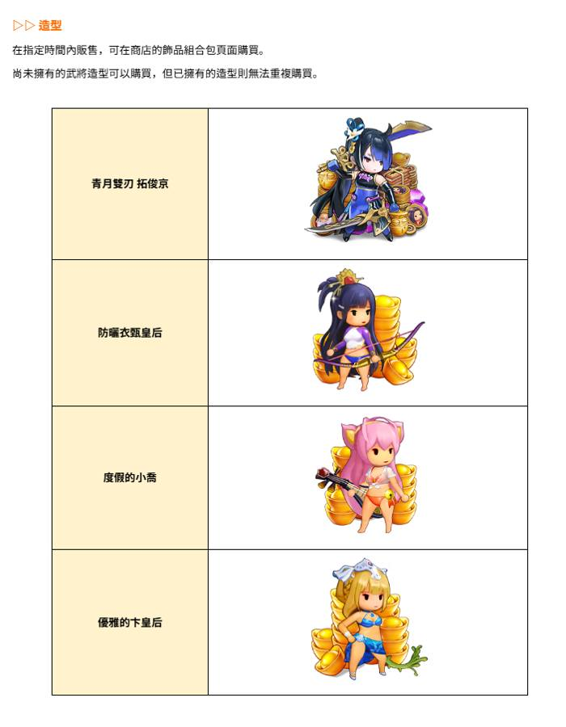

# 新武將介紹 - 拓跋京 (Cheok Jun-gyeong)
**Date:** Auguest 5, 2025  
**Type:** New Character Release  
**Event:** Darkness Warrior

## Announcement Images

## Summary
- New character: 拓跋京 (Cheok Jun-gyeong)
- Event type: Darkness Warrior
- 技能1【迅猛突斬】 ：對全體敵軍造成闇傷害。 每名目標 5～10 秒嗜睡，受到 10 次攻擊後解除，傷害量的 100% 吸血。
- 技能2【無瑕一斬】 ：嗜睡狀態的對象發動。 對全體敵人造成相當於其最大生命值 12.5%～25% 的比例傷害。
- 技能3【忠義之牆】 ：當體力低於 50% 時發動。（發動一次） 自身 3.6 秒內元氣恢復 100% 0.6～3 秒不屈 0.6～3 秒動亂 動亂對象：對全體敵軍。
- 技能4【先鋒之誓】 ：戰鬥開始時發動一次。 對最多 4 名敵軍造成閃屬性傷害。 每名目標 2～10 秒暈眩，受到 10 次攻擊後解除， 1.2～6 秒內降低元素抵抗 30%（最多疊加 2 層）。
