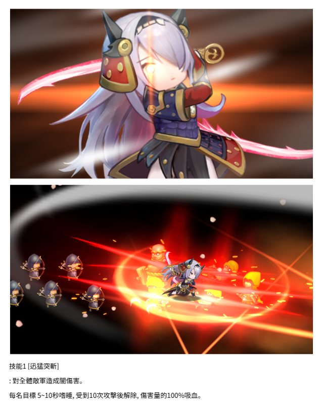

# New Character - 4 of   od 心 _ 的 a : 人从 Se ef 和  全 了 _ 和  gs. c e* a) .    7 . N   的 CN has 了  < 5 起 < 4 CN, FF |  fe  tS oo oe We  _ 站 四  . f 不  By oo 多 本 . tt cf N  这| 二 S ei PN SVS eo,   .  2 .  oe ose a SE _ Kd 过  Lad a o 要 |, . et ee & one a 3 oc am FRITEL SABER | SHEER FERME. BRAS 510 ER, 受到10次攻坚后解除, BESO RM. e 多 加  a :     2   . _ : PSP. . * i eee,   ww  see le ait ob us ae ra  . ary es a os ae     a  ai Se 2 Ss .  ois :   je e> .. > 机 e if .  技能2 无更一才 : 哮睡状态的对象屋动 对全肌敌人造成相当於其最火生命值12.5%居25%的上比例伤害 Eatin Ow  apa Se RK ge ay Tilt nei tthe, oa Cw rie 2 tng Oe ae ity te es . eae Ye. aac, . pw,  ne . BE oe gg | * . . 网 了 oo Were . 7 beet FQ 多 foe eet  s ae Fara) 人 Oe tee : *  wey. 技能3 SZ : BRATAEASSORETEE. (BH) 自身 3.6秒内 FERUIRE 100% 0.63各不届 0.63种动乱 DANS: HAE . bd ye . .  on 一 ine x   ad af  一 ens a . 4 oe ee oe DS 一  和 本 ok vee   e 一. 四 技能4 eid RMOMEDTRE 7. 1S S42 AAU SH. BLEU 2LOM ENE, PROTA, 1.2GH ALERT 30% (RSID B 上 新增技能效果 7H SOE, CRT RAEA, NHACERADRERTRA, MORE, MEERA RE BAAS HARA. ERCARRNTERR. > PART FZ. ROE SRR Bar SS > 388 IR, 一种 oe. ve 小  < ei ! ta  y (ei  in A : y <Y A gue > , ae an bf, fT  : (FOr BME ) . sw oe Y ie x a oF 全| 1 N 期亲限定相合包公和 相合包卫入寺到 202583878 四) 更析没下次更新闻| SERRE! BOR 元而25.000 et Ia AE: sae

**Date:** 2025-08-11  
**Type:** New Character  
**Status:** Active  

## Announcement Images

### Image 1


### Image 2


### Image 3


### Image 4


### Image 5


### Image 6


### Image 7


### Image 8


### Image 9


### Image 10


### Image 11


### Image 12


### Image 13


### Image 14


### Image 15


### Image 16


### Image 17


## Extracted Text

```
x a a a . (eH ae x an eo Z   人 人 4 WN ae : ae fa 7  a AS : . 4 ry : _ << ws 一  Se ee |  as   ,  vane { 机 7 v g 人 ae . 0 Bey ee | eB iz  一 1 亲爱的主公六好 ! APRS AA SRR ART ORY SRRVHH RARER (SMART) HECMRAH (as BARNS. ROAM HMAS HRT HRT | 不偿如此大家期待已久的 HERERO ECR BET | BEAR AB Zk, BOMADI 托俊京 也即将现身! SMIRMLARAM, PERROTT SR? BR. SRM LREES 8 月份的更新内容吧 ! Wt > > 新武将介绍 Hie CSM) 6S ye a KN Gim a Ww e BY. . a oe. y . Ca. LP ry 一 fi yp # Ss | _ aif wT  oy > yt ag r  ff ei oS LAIN i wre ryt wv ow . TAN : 4本  wal 一 4 一...
```

## Notes

- Images automatically detected and processed
- Text extracted using OCR technology
- For detailed information, please refer to the original announcement images

---

*Last updated: 2025-08-11 14:13:10*
