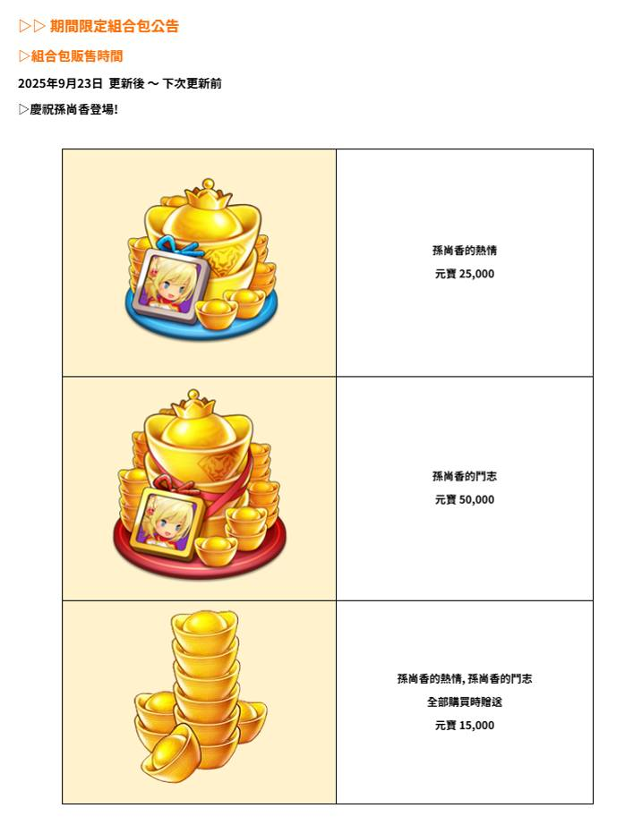

# 新武將介紹 - 明放 (New Character - Sun Shang Xiang)
**Date:** September 22, 2025
**Type:** New Character Release
**Event:** Special Release

## Announcement Images

## Summary
- New character: 明放 (New Character
- Event type: Special Character Release
- 技能1【[產火閃光] :對全骨閣生造成炎傷更‧ 嶼矛自身 1.5~3秒 暴腔率提升(立即套用) 元氣降低 50%、2-4秒組況、1~2秒疇倒,】：[產火閃光] :對全骨閣生造成炎傷更‧ 嶼矛自身 1.5~3秒 暴腔率提升(立即套用) 元氣降低 50%、2-4秒組況、1~2秒疇倒,
- 技能2【[幻流誌] : 鋪原、失明、深油、沉默、好座、寂靜、混亂、混沌、石化、石像化、恐怖、恐憫、麻六、聖域化 對象發動。自身 10秒內 治意、0.75~1.5秒淨化, 1.5~3秒疾風 將所受的異常狀態還計給敵人。 幻計對象 : 對最多4名啟人施加相當於持績時間42.00~~84.00%的幻計效果。】：[幻流誌] : 鋪原、失明、深油、沉默、好座、寂靜、混亂、混沌、石化、石像化、恐怖、恐憫、麻六、聖域化 對象發動。自身 10秒內 治意、0.75~1.5秒淨化, 1.5~3秒疾風 將所受的異常狀態還計給敵人。 幻計對象 : 對最多4名啟人施加相當於持績時間42.00~~84.00%的幻計效果。
- 技能3【{銷灌洛影] :每進行5次頁本攻軟時發動。 賤予自身 0.6~3秒 時還率提升(立即套用)。 從鞏軍後排開始, 最多對4名造成倡害。0.6~3秒粉擴鈣甲。】：{銷灌洛影] :每進行5次頁本攻軟時發動。 賤予自身 0.6~3秒 時還率提升(立即套用)。 從鞏軍後排開始, 最多對4名造成倡害。0.6~3秒粉擴鈣甲。

## Notes
- Images automatically detected and processed
- For detailed information, please refer to the original announcement images above

---
*Auto-generated on 2025-12-23 17:05:42*
