# 新武將介紹 - 寢生表點 (Dong Zhuo)

**Folder:** `2025-11-17-Emperor-Rarity-Dong-Zhuo`  
**Generated:** 2025-12-23 22:45:29

---

## 📷 Announcement Images

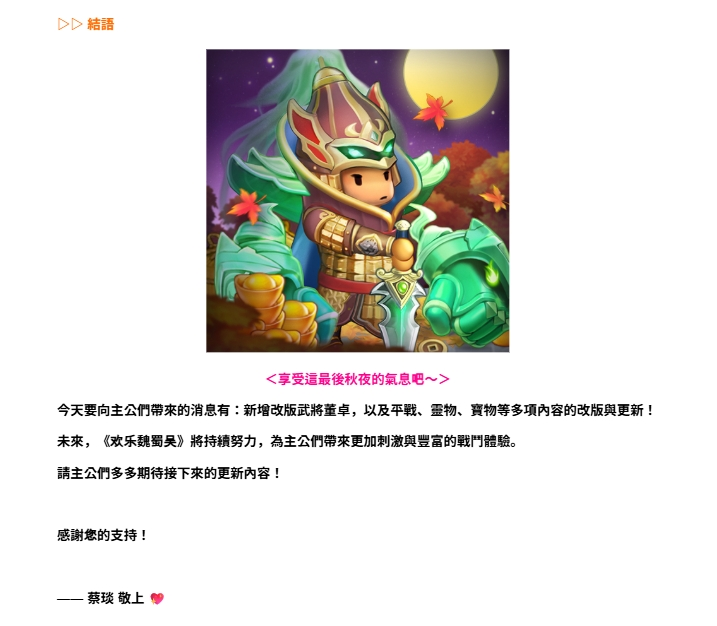

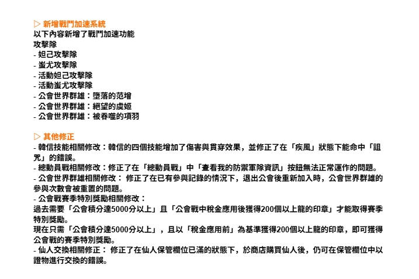

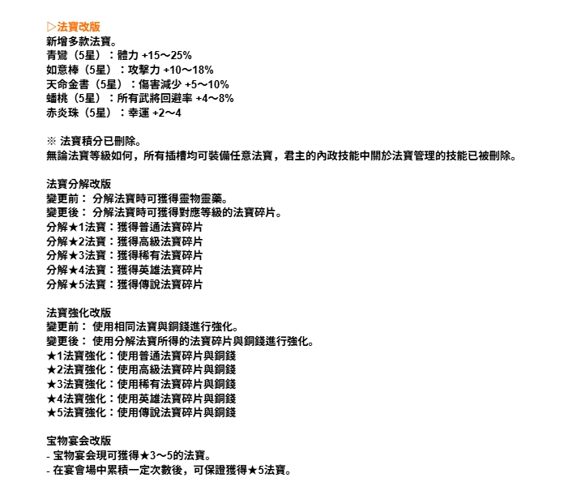

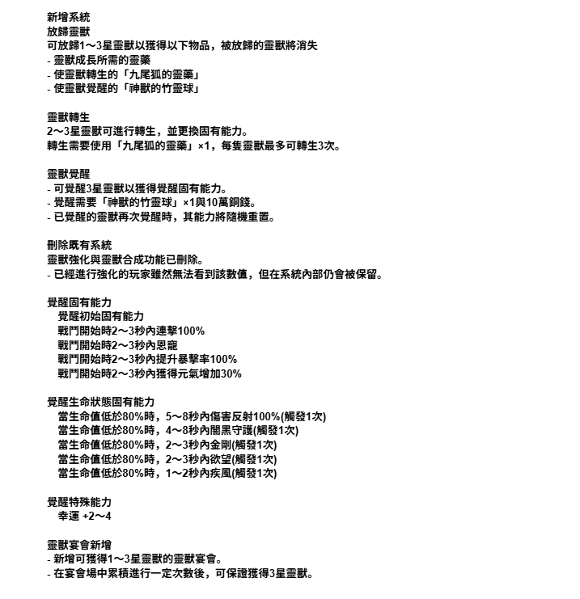

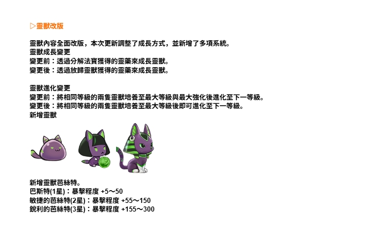

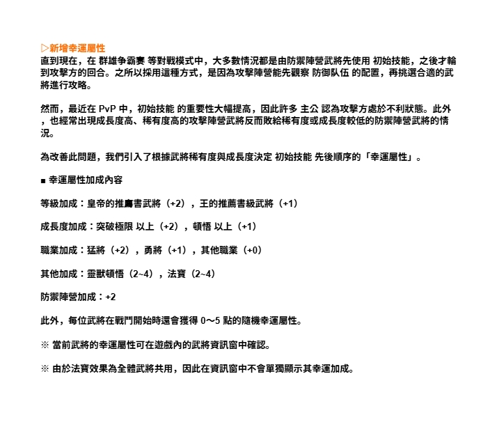

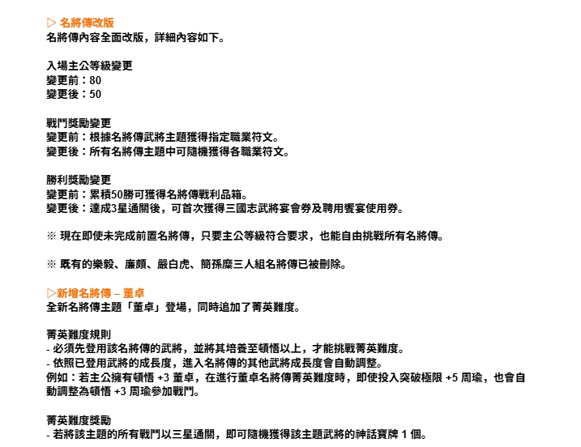

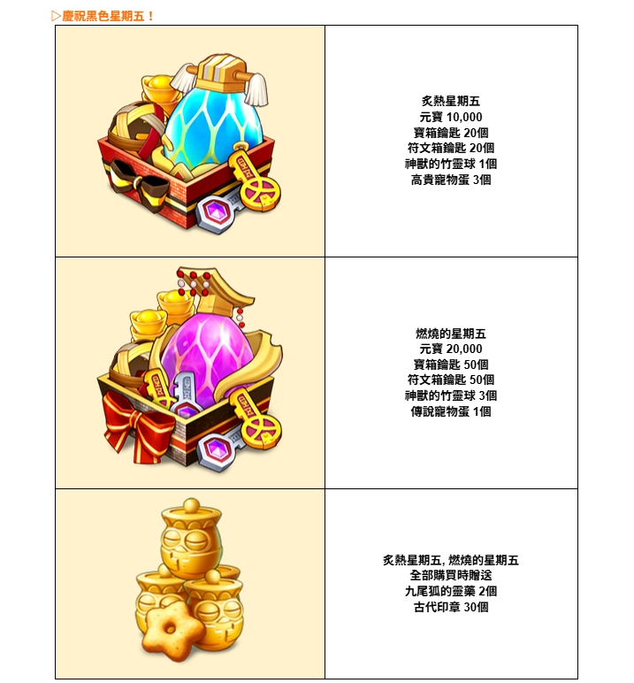

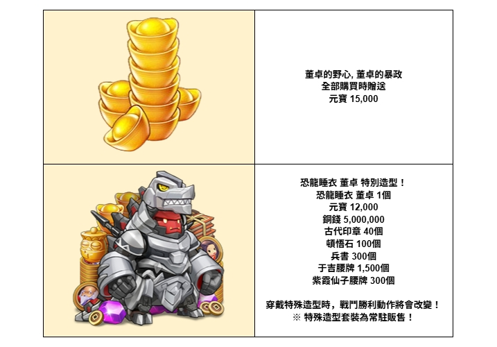

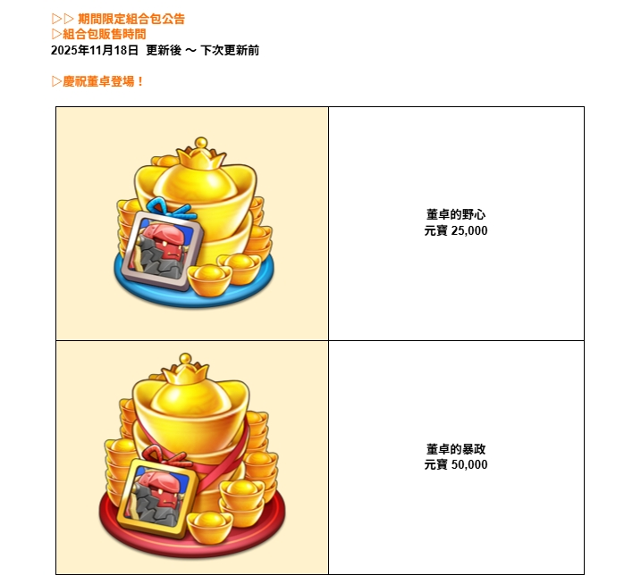


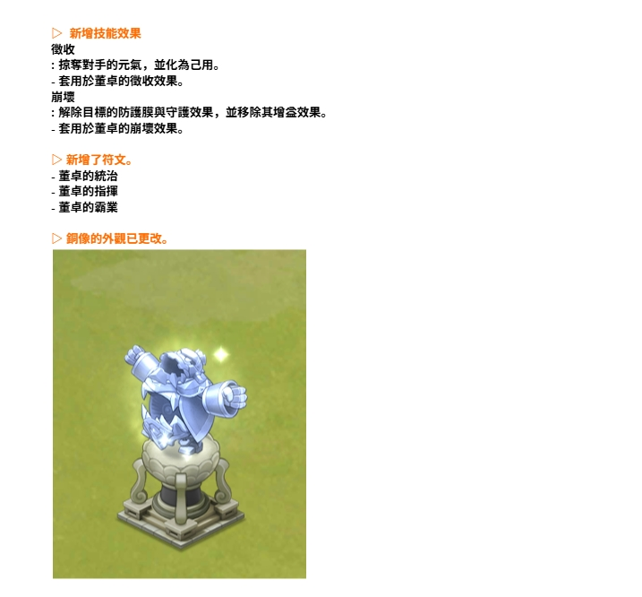

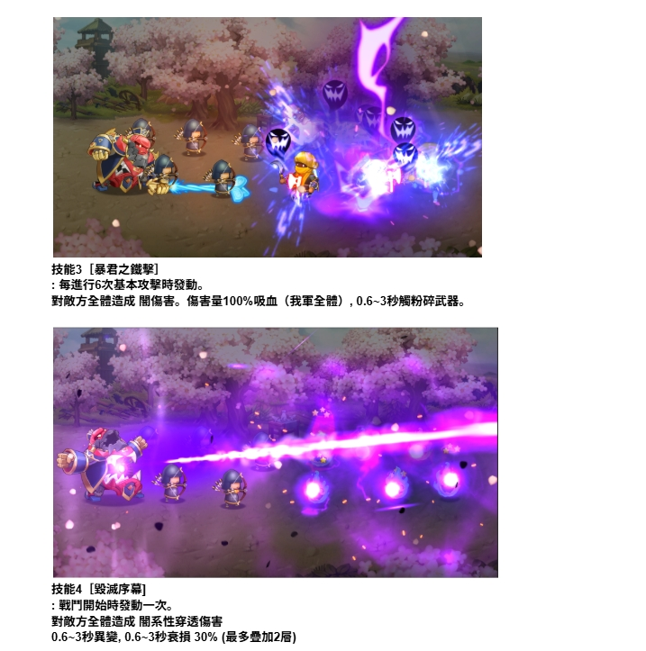

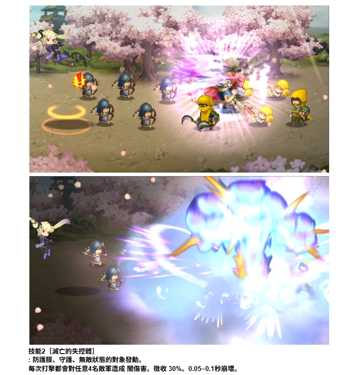

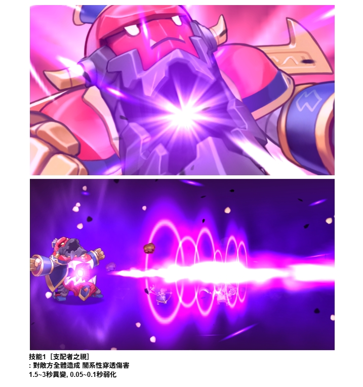

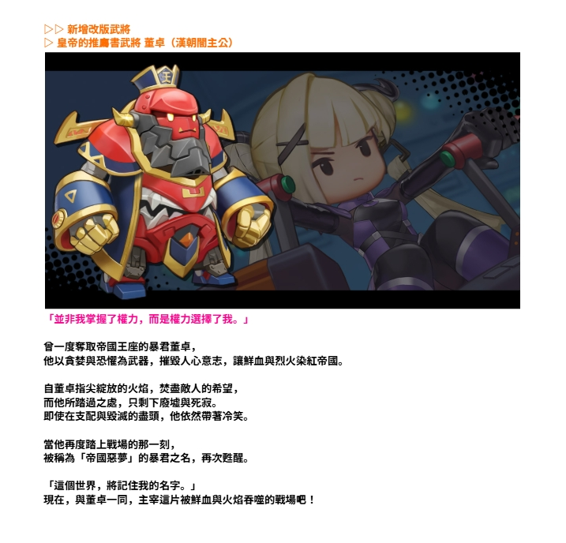

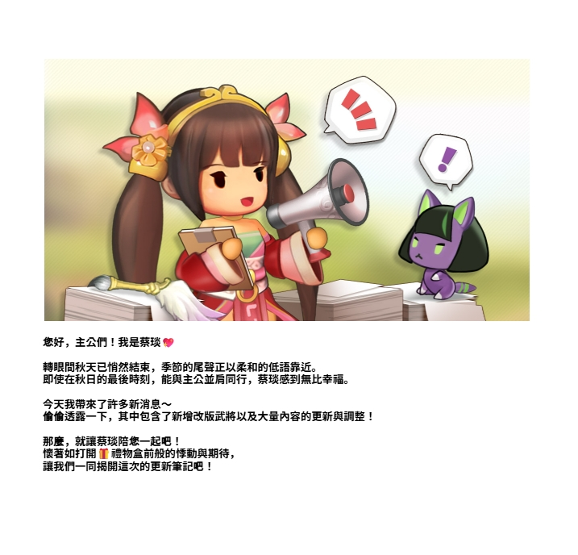

---

## 🔶 Character Name & Headers (Orange Text Detection)

```
和 全 還還戰神有寢生表點
```

## 💡 Highlighted Text (Brightness Detection)

```
/ ~ key mA 胃 合: as 「 章 人 + 性 b 及會 生、- 只他誠 ( 色轉及這最後科說的握息吧一一 分天嬰而主公們帶來的清竹有 : 新增改曆碟將重卓, 以及昱最、生物、買物等參項內容的改廬與更新 ! 未說, 《琴樂觀醫暴)】時持林聞力, 為主公們帶來更朮還泌與冒台的畫門裔陪, 爾主公們色色嗣竺擴下座的更右和內容  硬划姬約可排 一一 頑坑 瘋上 哆

汪 兩增加門下圈系統 以下內饋豆增了聘門如遠功能 或卉障 姻己靶罩孟 出尤攻罩扣 z醫竺妲己考量障 活動疼悶才轉險 公會世界主弔:酉雷的更增 公會世界語弔: 絕望的虎朮 公會世界評結:欄和媒噶項利 補 其他修正 - 轉信投講相了韻佑改:韓信的四個投諒增加了信穴員買摩效點, 普修正了在「穴風! 的和轉下讓命中(「配 甩」 的館襄。 - 廊動員眶相間佑攻:佑正了在 (「枉嘲員及! 中「坦看國約砍連和軍隊置訊」 摔時媽法正富這作的轅順 - 公會世界只盡祖毗僚交: 做正了在已有上夢舉記算的情宮下, 蟬出公會後重新思入時, 公會世界許姓的 夢與玄論會被重點的前點。 - 公會畫電學特別吾茲相關生交 昌去圖要 「公會太分家5000分以
... (truncated)
```

## 📝 Skills & Description (Standard OCR)

```
-.縛語 全 AN 全 神 有 AA 有滬 - 仿 4 yes 人 2 上 S 陸上,休1 ~ 加1 記 Li,全好 六 諒! 加 人) 全 人 ~ 計 人 安享受這最後秋夜的氣息吧~之 今天要向主公們帶來的消息有:新增改版武將董卓, 以及平角、靈物、寶物等多項內容的改版與更新 ! 未來, 《歡樂魂轉吳》將持續努力, 為主公們帶來更加刺激與十富的戰鬥體驗, 請主公們多多期待接下來的更新內容! 感謝您的支持 ! 一一蔡瑛 敬上 他

新增戰鬥加速系統 以下內容新增了戰鬥加速功能 攻擊際 - 姐己攻擊際 - 由尤攻擊隊 - 活動妲己攻擊際 - 活動當尤攻擊際 -公會世界群雄:唔落的和范堆 -公會世界群雄:絕望的虞姬 - 公會世界群雄:被吞噬的項乙 其他修正 - 嘉信技能相關修改:吉信的四個技能增加了傷害與貫說效果, 並修正了在「疾風」 狀態下能命中「詛 暫」 的錯誤。 - 還動員戰相關修改:修正了在「總動員戰」 中(查看我的防當生除資訊』 按鈕無法正常運作的問題, -公會世界群雄相關修改: 修正了在已有參與記錄的情況下, 退出公會後重新加入時, 公會世界群雄的 參與次數會被重咋的問題。 -公會戰賽季特別獎勵相關修改: 過去需要「公會積分達5000分以上」且「(「公會戰中稅金應用後獲得200個以上龍的印竟」 才能取得賽季 特別獎勵。 現在只需「公會積分達5000分以上」, 且以 「稅金應用前」為基準獲得200個以上能的印意, 即可獲得 公會戰的賽季特別獎勵。 -仙人交換相關修正: 修正了在仙人保管枷位已滿的狀態下, 於商店購買仙人後, 仍可在保管欄位中以 證物進行交換的錯誤,

法次改版 新增多款法寶。 青爛 (5星) :體力 +15一25% 如意棒 (5旺) :攻擊力 +10一18% 天命金書 (5星) :傷害減少 +5一10% 早桃 (5星) :所有武將回避率 +4一8% 赤炎珠 (5旺) :幸運 +2一4 ※ 法寶積分已副除, 無諭法寶等級如何, 所有插槽均可裝備任意法寶, 君主的內政技能中關於法寶管理的技能已被副除。 法寶分解改版 變更前: 分解法寶時可獲得亂物考藥, 變更後: 分解法寅時可獲得對應等級的法賣碎片。 分解女1法寶:獲得普通法賣碎片 分解友2法寶:獲得高級法賣碎片 分解友3法寶:獲得稀有法寶碎片 分解婦4法寶:獲得英雄法賣碎片 分解友5法寶:獲得傳說法寶碎片 法寶強化改版 變更前: 使用相同法寶與銅錄進行強化 變更後: 使用分解法寅所得的法寶碎片與銅錢進行強化 玄1法寶強化:使用革通法寶碎片與銅錄 玄2法寶強化:使用高弘法寶碎片與銅錄 玄3法寶強化:使用稀有法寶碎片與銅錄 玄4法寶強化:使用英雄法寶碎片與銅錄 玄5法寶強化:使用傳說法寶碎片與銅錄 室物宴會改版 -室物宴會現可獲得女3~5的法寶。 - 在宴會場中累積一定次數後, 可保玫獲得女5法寶。
```

---

*Generated by Kingdom Story Photo Scanner v2.0 (Enhanced Multi-Strategy OCR)*
