# 新武將介紹 - 我是蔡 (Monarch Class Rework)

**Folder:** `2026-01-19-monarch-class-rework`  
**Generated:** 2026-02-04 19:40:54

---

## 📷 Announcement Images

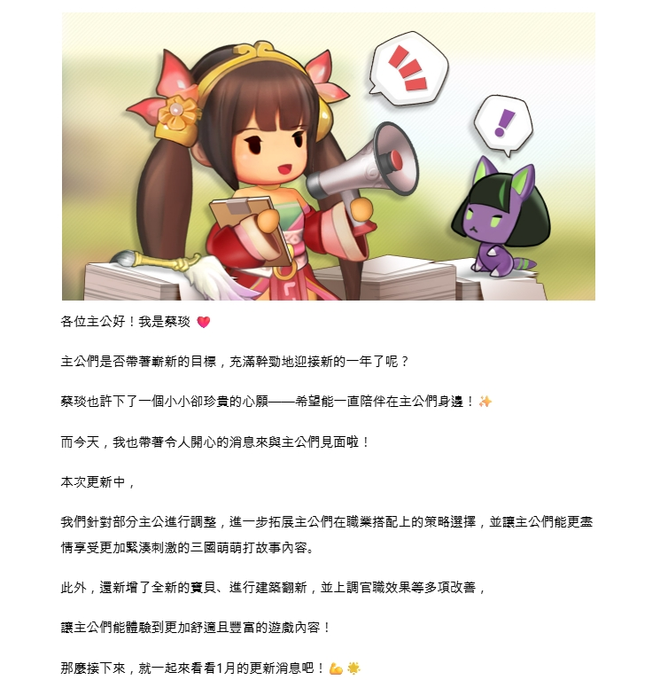

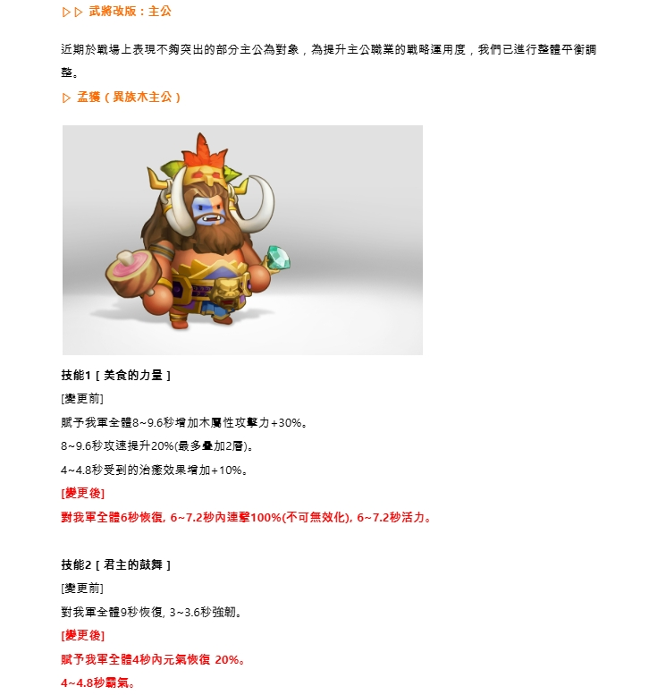

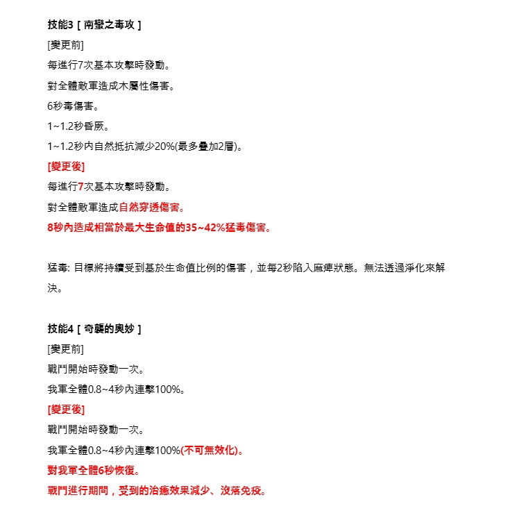

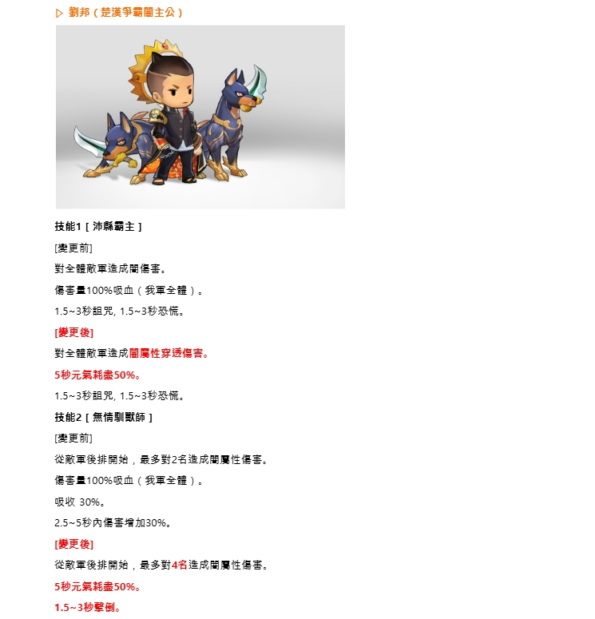

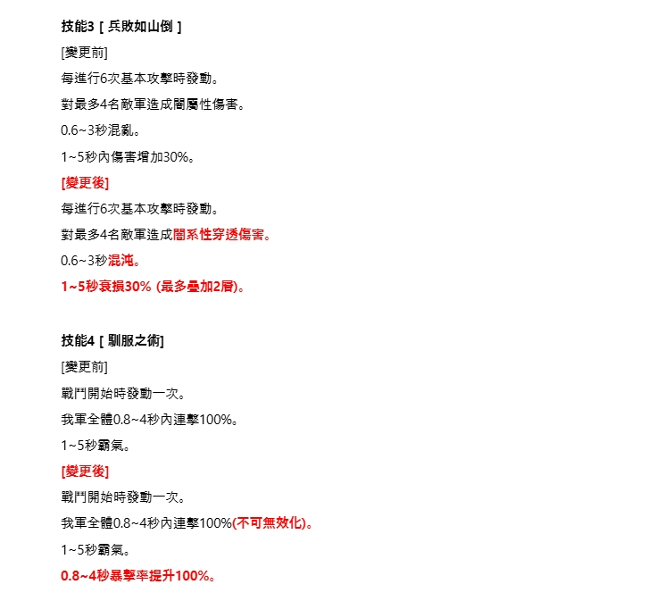

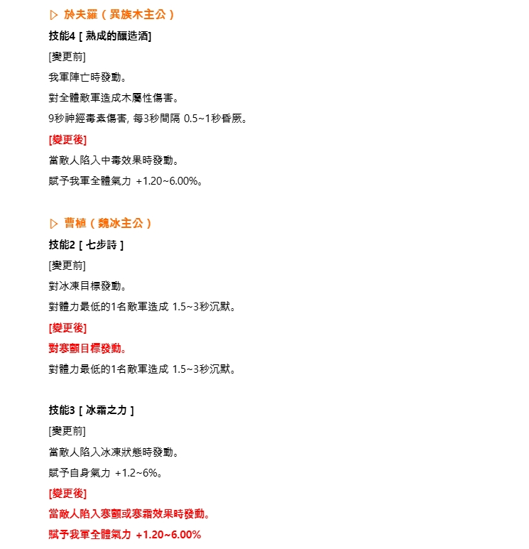

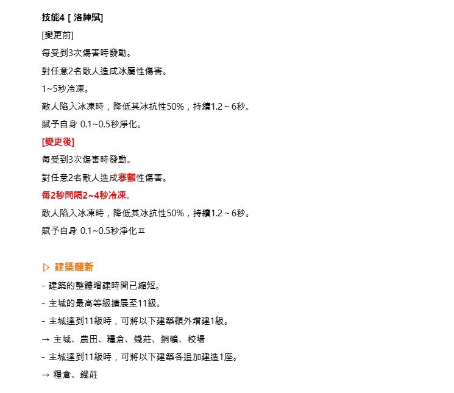

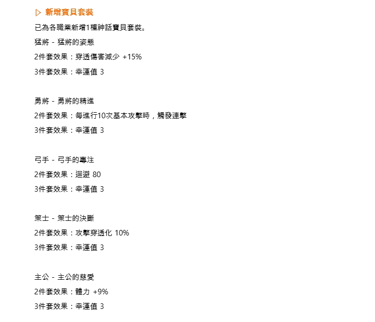

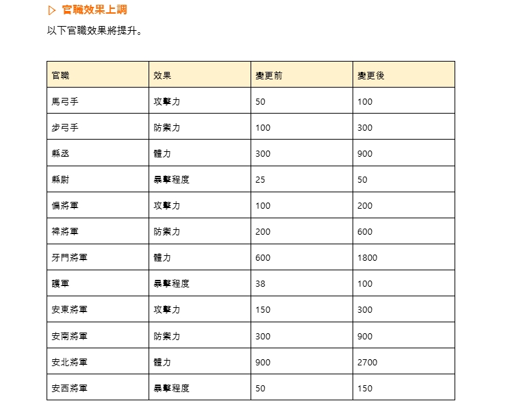

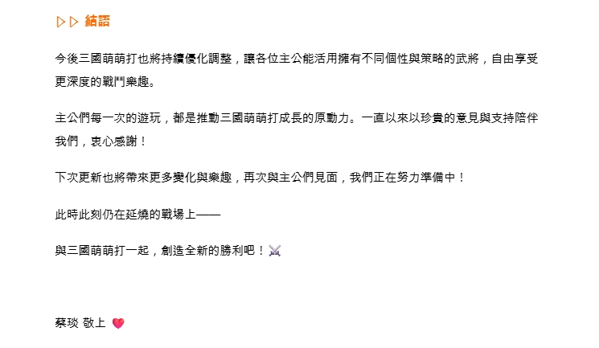

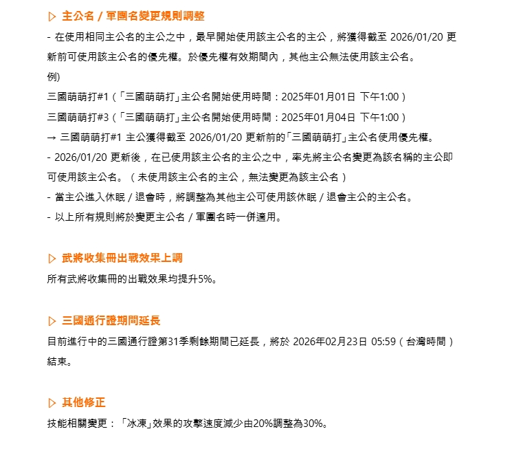

---

## 🔶 Character Name & Headers (Orange Text Detection)

```
人 $ ~二

ji【 點鹿吧計和僵 ;" 生國. 時有還吧介I 莖時和芝1 習儿百 還9人大人 6 '!了人林卅前 pa 閏肯和 6 了人「, 世時生] 藹當市二人有 和4 4 亡上還襄-

還友人 面世族選窒家, 9冰河入喊記生而還4生命全上一Lu區電辣可, 還友人 :早轉度共生 震沾百生 加9導宁位 二 二還同 噴還主詢加擴用渦多 宇加個統,
```

## 💡 Highlighted Text (Brightness Detection)

```
人時 吧: ? 【 全 (他 上 0 人一、 罰 襄位主公好 ! 我是蔡殃 他 主公們是否黃荔嶄新的目神 , 充滿幹矣地迎挫新的一年了吧 ? 蔡球也許下了一個小/ 小卻珍貴的心雇一一碩吾能一直陪伴在主公們身邊 ! 而今天 , 我也帶著令人開心的消息來與主公們見面啦 ! 本次點新中 我們針對部分主公入行柄整 六一步祐護主公們在職站搭記上的策略選擇 , 並苹主公們能更崙 情享腔臣加囚漠再病的三國拓萌打故惠內容 通新增了全新的寶貝 送行建築障新 , 並上調宮上蟻效果衝多項改薔 廊主公科能體號到互加舒站且豐富的遊戲內容 ! 鞍摩探下來 , 執一起來看故1月的點新粗息吧 !

當心 臣呆避點: 主公 近期還戰場上表現不舞災出的晉分主公旋對象 , 為更升主公職加的獸熙運用度 , 我們已進行整體平卻圖 罩 六 孟狼( 軸歲木主人久 ) 【 t~ 1 人 人 2 吃 還 技館1[ 芙食的力量 ] [瘓更訂] 隱乎我軍全同B~9.6秒增加木民性攻擊力+3036, 8B~9.6憩攻癌揭升2036(最多曼加2諸), 4~4.B徐要到的浴并癌果增加+103, [廚更點] 點人污軍全體5友怖笨, 65~7.2秒
... (truncated)
```

## 📝 Skills & Description (Standard OCR)

```
人 3) (和 務 2 ) / 次 / 和 全 ? 2 人 4 22紋 寢 昭 2 全 和 點 一劑 ry 和 各位主公好 ! 我是蔡玖 什 主公們是否帶著細新的目標 , 充滿幹勁地迎接新的一年了呢 ? 蔡瑪也許下了一個小小卻珍喧的心願一一希望能一直陪伴在主公們身邊! 而今天 , 我也帶著令人開心的消息來與主公們見面啦 ! 本次更新中 , 我們針對部分主公進行調整 , 進一步拓展主公們在職業搭配上的策略選擇 , 並讓主公們能更妻 情享受更加緊湊刺激的三國壓萌打故事內容, 此外 , 還新增了全新的次貝、進行建築翻新 , 並上調官職效果等多項改善 , 讓主公們能體驗到更加舒適且豐富的遊戲內容 ! 那麼接下來 , 就一起來看看1月的更新消息吧! (

>已 武將改版:主公 近期於戰場上表現不夠突出的部分主公為對象 , 為提升主公職業的戰略運用度 , 我們已進行整體平衡調 整, > 孟獲 ( 異族木主公 ) 負語 生十 Ge 人 *人 膏作4 技能1[ 美食的力呈 ] [變更前] 晤予我軍全骰8~9.6秒增加木屬性攻擊力+3096。 8~9.6秒攻速提升20%(最多疊加2第), 4~4.8秒受到的治癒效果增加+10%。 [變更後] 對我軍全體6秒恢委, 6~7.2秒內連擊1009%(不可無效化), 6~7.2秒活力。 技能2 [ 君主的鼓舞 [變更前] 對我軍全體9秒恢復. 3~3.6秒強熙, [變更後] 農予我軍全體4秒內元氣焦復 209%6。 4~4.8秒霸氣,

技能3[ 南對之毒攻 ] [引更前] 每進行7次基本攻擊時發動, 對全體敵軍造成木屬性傷害。 6秒毒傷害。 1~1.2秒錯厥。 1~1.2秒內自然抵抗減少2096(最多疊加2層)。 [變更後] 每進行7次基本攻擊時發動。 對全體敵軍造成自然穿透傷害。 8秒內造成相當於最大生命值的35~4235鋒毒傷害。 猛毒: 目標將持續受到基於生命值比例的傷害 , 並每2秒陷入麻姜狀態。 無法透過淨化來解 決。 技能4[ 奇衣的與妙 ] [引更前] 戰鬥開始時發動一次。 我軍全體0.8~4秒內連擊10096。 [變更後] 戰鬥開始時發動一次。 我軍全體0.8~4秒內連擊1009(不可無效化)。 對我軍全體6秒恢復。 戰鬥進行期間 , 受到的治癒效果減少、沒落免疫。
```

---

*Generated by Kingdom Story Photo Scanner v2.0 (Enhanced Multi-Strategy OCR)*
