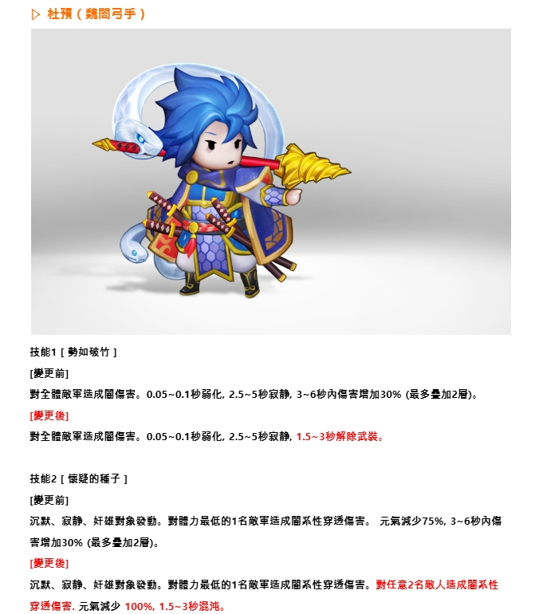
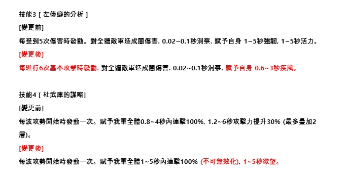
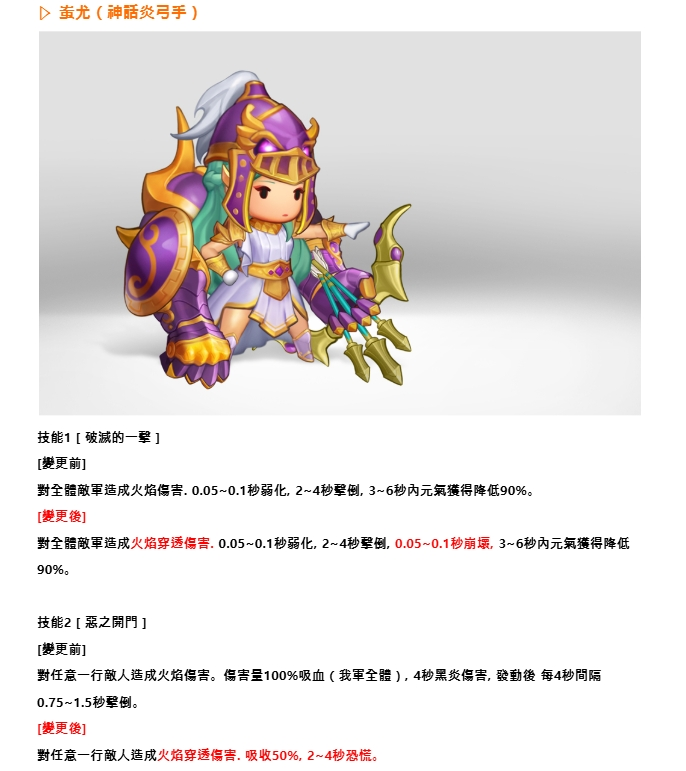
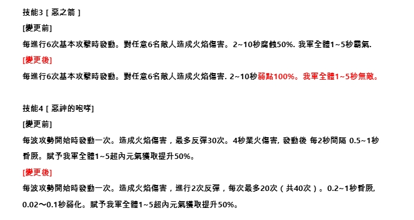
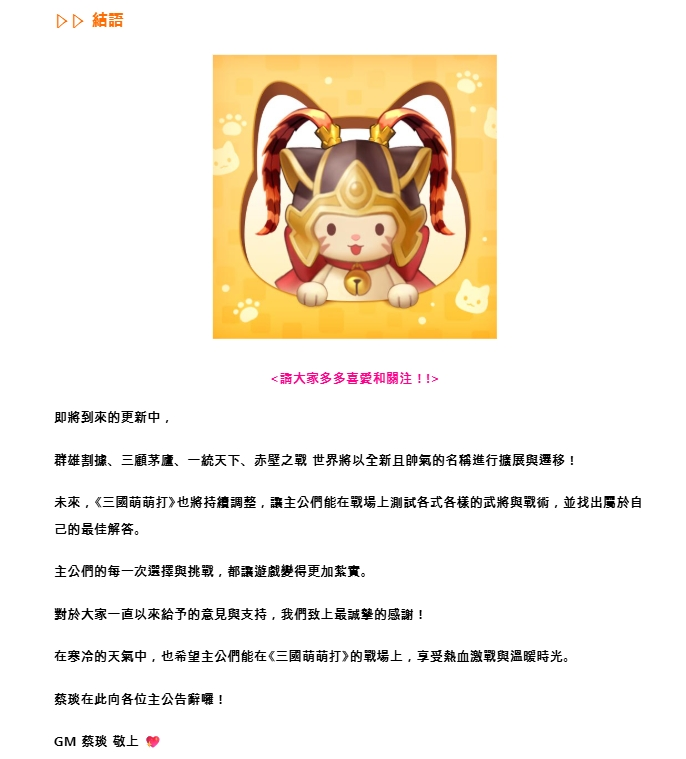

# 新武將介紹 - 人入廬 (Bowmaster Class Rework)

**Folder:** `2026-02-03-bowmaster-class-rework`  
**Generated:** 2026-02-04 19:41:04

---

## 📷 Announcement Images













---

## 🔶 Character Name & Headers (Orange Text Detection)

```
," 馬劉: 還轉曙吧 ! 計 還 繼 哪時全1 11 ,思只旺陳, 哪時太1 而二者/反符。人入廬輻馬避 廊醫軍窒 口語 ,

:' 品黃上加。舉四 第 4 學

Me
```

## 💡 Highlighted Text (Brightness Detection)

```
心 社牧(帳導選學 ) -NN 信2 / 9 和 %1 29 了 大 』 才 X (2 we本 技館1 [ 馬坎碩竹 ] [廚更前] 轉全蘭項軍彷成圖傷害。0.05~-0.1秒而矯, 2.5~5竺避諱, 3~5碩內傷害壇加309 (最名曙加2必)。 [廚更點] 點全上項單衝成圖傷害。 0.05~0.1秒而矯, 2.5~5竺避諱 1.5~3秒狐除武玻。 技館z[售睡的革子 ] [廚更前] 諜計、屆下、奸媽點象說動, 對葷力最克的1名冰軍舌成圖系性守旭夫害, 元氣尖少75$%, 3~6秒內伍 害讀朮30% (歡多疊加2飛), [廚更點] 諜計、了以廬、奸畫點象發動, 對葷力最克的1名汞軍舌成圖系性守旭夫害, 對任意2名鞏人舌成圖系性 穿媒傷害. 元氣痢許 100$e 1.5~3秒再擊,

必必 時還虱電 : 吧字 ! 2  六 近昌在講壇上去現崗為胡限的部分號手 , 旨了葡化三手職時的點術堅輸與明門買獻 已對整圖平暫僧行圖困-

人 店 2 歸 / *介 一 seeeooy 2 一 人 ie 主公們 . 拿好[匡亞訂哈 垃 在量近交鬱前溶的日子裡 , 主公們贍週查畔好私 7 藝聘一超車用著
... (truncated)
```

## 📝 Skills & Description (Standard OCR)

```
記 杜預 ( 萄章吃手 ) 了 人 讓 5 則放 网1 了 二顏 g ? 2 主 必 [0 加六 ~ 多 入. , 人 未 技能1 [ 勢如破竹 ] [變更前] 對全體敵曙造成圈傷害。0.05~0.1秒弱化, 2.5~5秒罕靜, 3~6秒內傷害朮加3096 (蔭多灶加2居)。 [變更後] 對全體英軍造成圈傷害。0.05~0.1秒弱化, 2.5~5秒寂靜, 1.5~3秒解除武裝 技能2 [人情疑的種了 ] [變更前] 況默、窗靜、奸雄對象發動。 對體力最低的1名英軍造成圈系性穿透條害。 元氣減少759%, 3~6秒內售 害朮加3096 (蔭多時加2居)。 [變更後] 況默、贍靜、奸雄對象發動。 對體力最低的1名英軍造成圈系性穿透信害。 對任意2名敵人造成章系性 穿透傷害. 元氣減少 10096, 1.5~3秒混沌,

共訪 武將改編: 弓手 克 了 陪 時 陸蝦4 人 和NMVY 冉 ?》.y 三 人 3 (9@吵 近期在嚷場上表現較為受限的部分弓手 , 為了強化弓手職業的戰術選擇與品門頁獻度 , 已對茲體平衛進行而整。

人 (和 7) 時 說) / t 悶 / 和 9 ? 和二ee ms 人 加點 一了 還 主公們 , 您好! 花下來啦 商 在最近這樣寒冷的日子裡 , 主公們都過得還好嗎 ? 北斑一中享用著熱騰騰的鉛魚料和包子 , 一下溫暖身心 , 努力挫過這波寒意呢 ! 今天 , 茲玟也人胞著令人開心的消息來拜訪主公們只 ! 在本次更新中! 我們蛋新綢整了部分弓手的品術定位與性能 , 蛋主公們能夠更加暢快地體驗充滿魄力的《三國萌萌 打》! 那塵現在 , 就苹我們一起來看者 2月更新內容 吧1!
```

---

*Generated by Kingdom Story Photo Scanner v2.0 (Enhanced Multi-Strategy OCR)*
